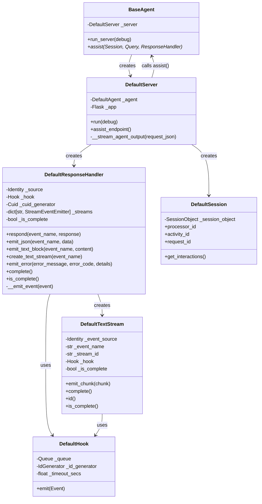
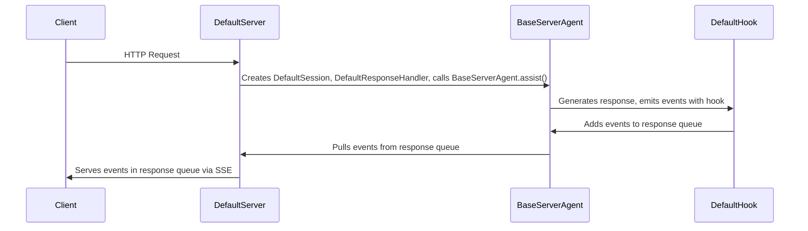
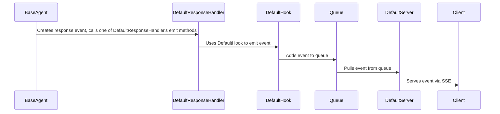

## Architecture

> [!NOTE]  
> The above class diagram is a simplified view of the implementation. It omits the `BaseServerAgent` class, because it is just used to avoid a circular dependency between the `BaseAgent` and `DefaultServer` classes (both classes depend on the `BaseServerAgent` class rather than directly on each other). It also omits the `DefaultIdGenerator` class, which is used by the `DefaultHook` class to generate unique IDs for events.

## Operation Flow 
#### Request Handling

#### Event Processing

## Key Components
> [!NOTE]  
> `BaseServerAgent` and `BaseAgent` are subclasses of the `AbstractAgent` class defined in the interface module. They are not concrete implementations of the `AbstractAgent` class (neither implements the `assist()` method), and thus cannot be used directly.

#### BaseServerAgent
- Used to avoid a circular dependency between the BaseAgent and DefaultServer classes (both classes depend on this class rather than directly on each other).
- Has a `Queue` and a `DefaultHook` for event emission.

#### BaseAgent
- Subclassses `BaseServerAgent` class and adds server capabilities using a `DefaultServer`.

#### DefaultResponseHandler
- Implements `ResponseHandler` protocol
- Core features:
    - Event source tracking
    - Stream management
    - Event emission via hook
- Key methods:
    - `respond()`: Sends complete responses
    - `emit_json()`: Sends JSON events
    - `emit_text_block()`: Sends text blocks
    - `create_text_stream()`: Creates text streams
    - `emit_error()`: Sends error events
    - `complete()`: Marks response as complete

#### DefaultTextStream
- Implements `StreamEventEmitter` protocol
- Core features:
    - Stream source tracking
    - Completion state tracking
    - Chunk emission
- Key methods:
    - `emit_chunk()`: Sends text chunks
    - `complete()`: Marks stream as complete

#### DefaultHook
- Implements `Hook` protocol using a `Queue`
- Features:
    - Event ID generation
    - Timeout management
    - Queue management
- Key methods:
    - `emit()`: Adds event to queue

#### DefaultServer
- Flask-based SSE server
- Core features:
    - Exposes `assist` HTTP endpoint
    - Processes requests
    - Streams agent output
- Key methods:
    - `assist_endpoint()`: `assist` HTTP endpoint
    - `stream_agent_output()`: Calls agent's `assist()` method and yields the output as well-formed SSE events

#### DefaultSession
- Implements `Session` protocol

#### DefaultIdGenerator
- ULID-based identifier generator
- Core features:
    - Monotonic ID generation
    - Thread-safe operation
    - Timestamp-based offsets
- Key methods:
    - `get_next_id()`: Generates a new ULID