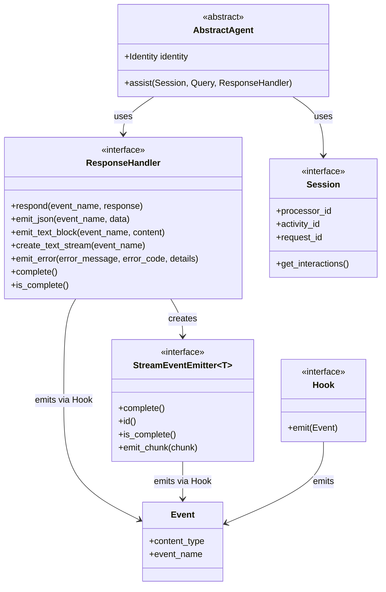
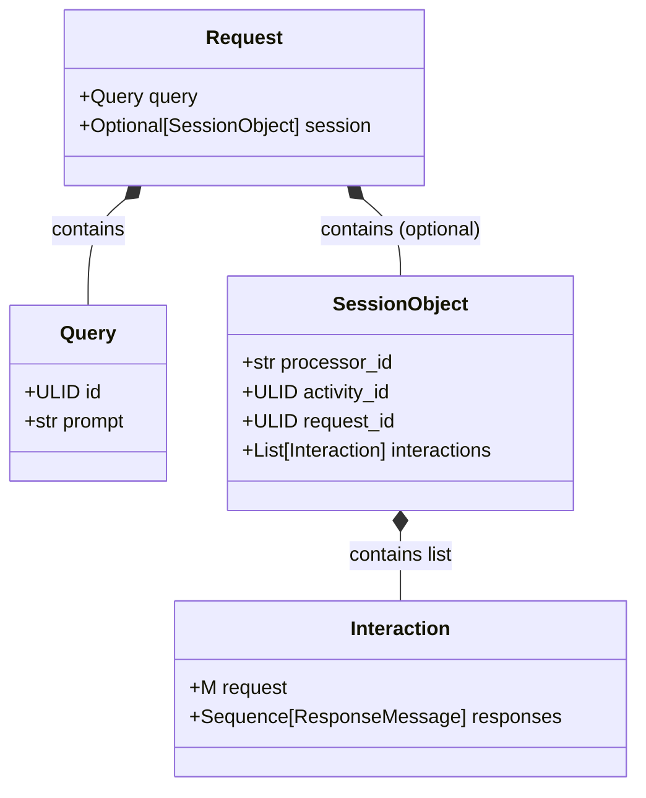
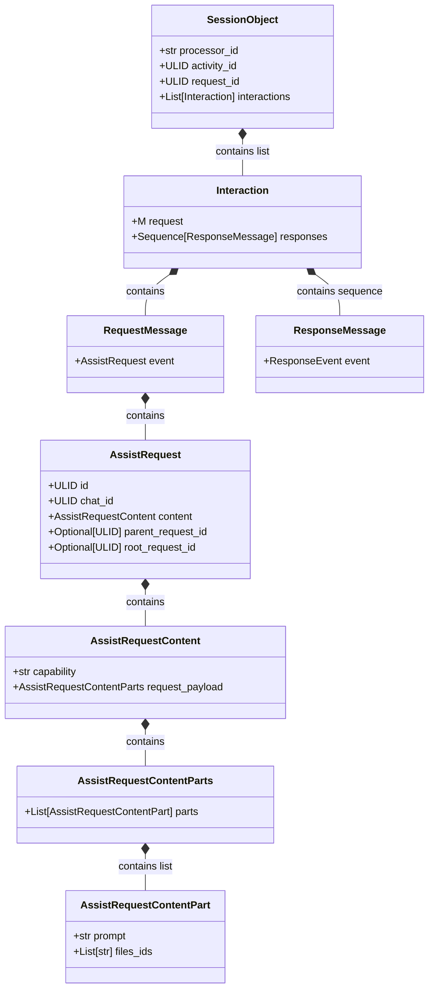

# Interface
## Architecture
#### Agent Abstract Base Class
The `AbstractAgent` class is an abstract base class that defines the specification for an agent. It is not intended to be used directly, but rather to be subclassed by concrete agents that implement the `assist()` method. It, along with all of the interfaces that it depends on, are defined but not implemented in the `interface` module.



#### Request Interface
The `Request` interface defines the specification for HTTP requests to an agent (requests would be sent by Sentient Chat - agent developers are not responsible for building and sending these requests).



#### Session Interface
The `Session` interface defines the specification for a Sentient Chat session between a user and an agent. 



## Key Components
#### AbstractAgent
- Abstract class that must be subclasses by concrete agents that implement the `assist()` method
- Uses `ResponseHandler` to emit responses
- Processes `Request` objects
- Key methods:
    - `assist()`: Process `Request` objects and emit responses

#### ResponseHandler
- Protocol (interface) for handling different types of responses
- Emits `Event` objects to the client using a `Hook`
- Key methods:
    - `respond()`: Sends complete responses
    - `emit_json()`: Sends JSON events
    - `emit_text_block()`: Sends text blocks
    - `create_text_stream()`: Creates text streams
    - `emit_error()`: Sends error events
    - `complete()`: Marks response as complete

#### Hook
- Interface for emitting events to external systems
- Key methods:
    - `emit()`: Emits an event

#### Events
```
Event (base class)
└── BaseEvent
    ├── AtomicEvent (single messages)
    │   ├── DocumentEvent
    │   ├── TextBlockEvent
    │   ├── ErrorEvent
    │   └── DoneEvent
    └── StreamEvent
        └── TextChunkEvent (streaming text)
```
- `DocumentEvent`: JSON content
- `TextBlockEvent`: Complete text blocks
- `TextChunkEvent`: Streaming text chunks
- `ErrorEvent`: Error messages
- `DoneEvent`: Completion markers

#### Session
- Provides context for agent interactions
- Key methods:
    - `processor_id`: (Getter) Identifies the processor
    - `activity_id`: (Getter) Identifies the activity (e.g., chat)
    - `request_id`: (Getter) Identifies specific request
    - `get_interactions()`: (Getter) Interaction history